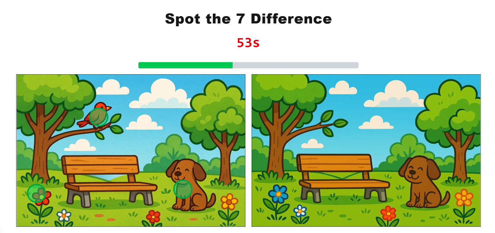
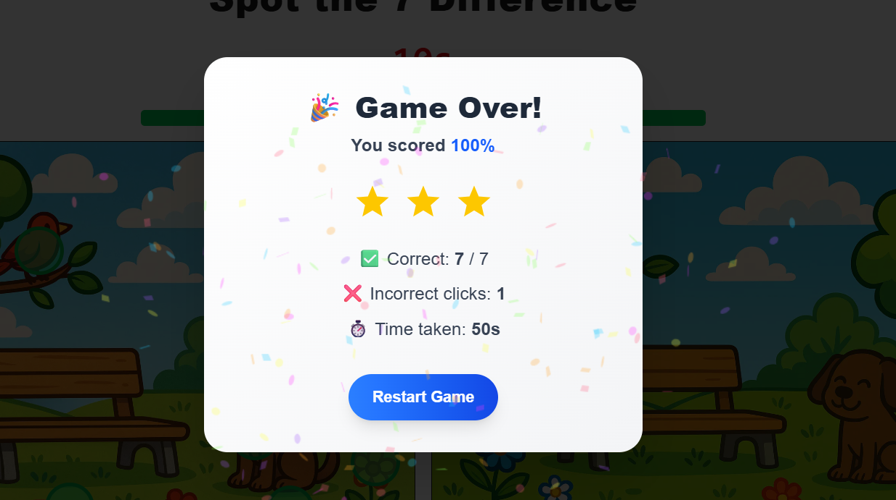

# 🕹️ Spot the Difference Game

A fun, interactive “Spot the Difference” game built with **Next.js**, **Tailwind CSS**, **TypeScript**, and **Framer Motion** — fully configurable with a simple JSON file.

---

## 🎮 Features

✅ Two images side-by-side — find all the differences!  
✅ JSON-based configuration for images & hotspots — no hardcoding.  
✅ Click to spot differences — shows animated circles for feedback.  
✅ Tracks correct and incorrect clicks.  
✅ Arcade-style countdown timer with flicker & screen alert in the last 3 seconds.  
✅ Progress bar that fills up as you find more spots.  
✅ Confetti and stars on completion.  
✅ Earn live badges for speed, accuracy & combos.  
✅ Fully responsive for mobile & desktop.  
✅ Clean, modular React components.

---

## 🗂️ How the JSON Config Works

The entire game is powered by a `config.json` file in the `public/` folder.

### ✅ What’s inside `config.json`?

```json
{
  "gameTitle": "Spot the 7 Difference",
  "images": {
    "image1": "/images/image1.png",
    "image2": "/images/image2.png"
  },
  "differences": [
    { "x": 100, "y": 200, "width": 50, "height": 50 },
    { "x": 300, "y": 150, "width": 40, "height": 40 },
    { "x": 500, "y": 300, "width": 30, "height": 30 }
  ]
}
```

### ✅ How is it used?

* **Dynamic import**: The config is fetched dynamically using `fetch('/config.json')` inside the custom `usespot` hook.
* **Images**: Sets the source for the left and right images.
* **Differences**: Defines clickable hotspots with x, y coordinates and bounding box size.
* **Easy updates**: To change images or spots, just edit `config.json` — no need to touch any React code.

---

## 📁 Project Structure

```
📦 spot-the-difference/
├── hooks/
│   └── usespot.tsx              # Custom hook with game logic and state
│
├── components/
│   ├── header.tsx               # Game header (title + timer display)
│   ├── images.tsx               # Image pair + clickable canvas overlays
│   ├── result.tsx               # Result modal with score, stars, restart
│   ├── progressbar.tsx          # Progress bar component
│   ├── timer.tsx                # Timer component with flicker effect
│   └── helpers.tsx              # Shared helper functions (finish, restart, stars)
│
├── public/
│   ├── images/
│   │   ├── image1.png
│   │   └── image2.png
│   └── config.json              # JSON config for images and hotspots
│
├── app/
│   ├── page.tsx                 # Main page that ties everything together
│   └── globals.css              # Tailwind global styles
│
├── package.json
├── next.config.js
└── README.md

```
---

## ⚛️ Tech Stack

This project leverages modern React ecosystem tools to deliver a fast, interactive, and maintainable experience:

* **React.js (Next.js App Router)** — using hooks, dynamic state, and modular client components to manage gameplay logic and state.
* **Tailwind CSS** — utility-first styling for responsive design.
* **TypeScript** — for strict type safety and maintainable code.
* **Framer Motion** — for subtle animations and gamification effects.

---

## 🚀 Getting Started

### ✅ Install dependencies

```bash
npm install
```

### ✅ Run the dev server

```bash
npm run dev
```

Visit [http://localhost:3000](http://localhost:3000) to play!

---

## 📸 Screenshots

| Gameplay                                       | Result Modal                                           |
| ---------------------------------------------- | ------------------------------------------------------ |
|  |  |

---


