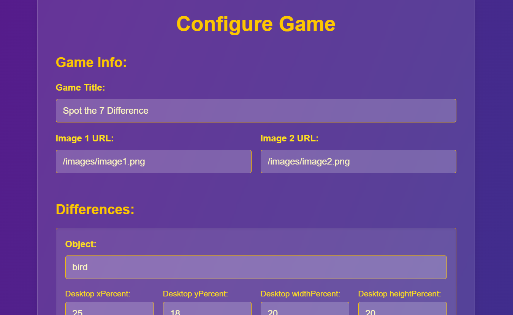
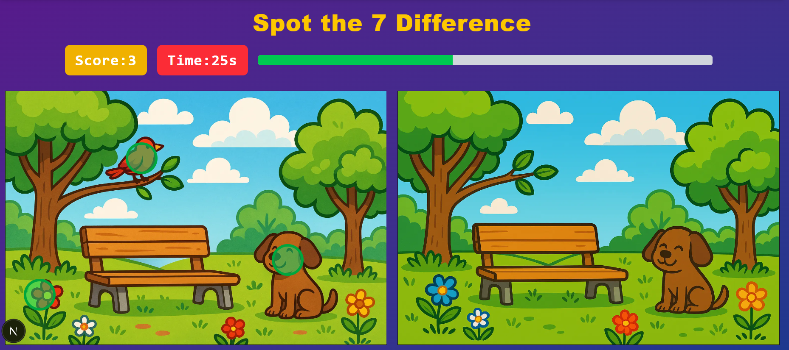

# 🕹️ Spot the Difference Game

A fun, interactive “Spot the Difference” game built with **Next.js**, **Tailwind CSS**, **TypeScript**, and **Framer Motion** — fully configurable with a simple JSON file.

---

## 🎮 Features

✅ Two images side-by-side — find all the differences!  
✅ JSON-based configuration for images & hotspots — no hardcoding.  
✅ Click to spot differences — shows animated circles for feedback.  
✅ Tracks correct and incorrect clicks.  
✅ Arcade-style countdown timer with flicker & screen alert in the last 3 seconds.  
✅ Progress bar that fills up as you find more spots.  
✅ Confetti and stars on completion.  
✅ Fully responsive for mobile & desktop.  
✅ Clean, modular React components.

---

## 🗂️ How the JSON Config Works

The entire game is powered by a `config.json` file in the `public/` folder.

### ✅ What’s inside `config.json`?

```json
{
  "gameTitle": "Spot the 7 Difference",
  "images": {
    "image1": "/images/image1.png",
    "image2": "/images/image2.png"
  },
  "differences": [
    {
      "object": "bird",
      "desktop": {
        "xPercent": 30,
        "yPercent": 20,
        "widthPercent": 12,
        "heightPercent": 15
      },
      "mobile": {
        "xPercent": 28,
        "yPercent": 24,
        "widthPercent": 14,
        "heightPercent": 18
      }
    },

    // More differences...
  ]
}

```

### ✅ How is it used?

✔️ **Dynamic import:**
The config is dynamically loaded via `fetch('/config.json')` or from **localStorage** in your custom `usespot` hook.

✔️ **Images:**
Controls the left and right image sources for the game.

✔️ **Differences:**
Defines **hotspots** that players must find. Each difference includes:

* An **object name** (`"bird"`, `"flower"`, etc.) for easier editing.
* Separate **`desktop`** and **`mobile`** coordinates with `xPercent`, `yPercent`, `widthPercent`, `heightPercent` for responsive gameplay.

✔️ **Easy updates:**
Want to change images or spots? Just edit `config.json` — no need to touch any React or TypeScript files.

---

## ⚙️ Configuration Screen

This game includes a **Visual Config Screen** to make it fully editable without touching code.

### 🗂️ Where to find it

- **Home:** runs at [`/`](http://localhost:3000) (`app/page.tsx`)
- **Game:** runs at [`/`](http://localhost:3000/game) (`app/game/page.tsx`)
- **Configuration:** runs at [`/config`](http://localhost:3000/config) (`app/config/page.tsx`)



---

### 🔑 How it works

1. Visit [`/config`](http://localhost:3000/config) to update:
   - **Game Title**
   - **Image 1 & Image 2 URLs**
   - **Hotspot differences** :
      * `object` name
      * `desktop` and `mobile` `xPercent`, `yPercent`, `widthPercent`, `heightPercent`

2. Click **“Save Configuration”** — this stores your changes in **localStorage**.

3. When you return to the game (`/`), the game automatically:
   - Loads your saved config from **localStorage** (if it exists).
   - Falls back to the default `config.json` if no custom config is saved.

---

### 🚀 Why this matters

This demonstrates **the power of React’s hooks, state, and local storage** to make the game **dynamic**, **configurable**, and **user-friendly** — all in the browser!

---

## 📁 Project Structure

```
📦 spot-the-difference/
├── hooks/
│   └── usespot.tsx              # Custom hook with game logic and state
│
├── components/
│   ├── header.tsx               # Game header (title + timer display)
│   ├── images.tsx               # Image pair + clickable canvas overlays
│   ├── result.tsx               # Result modal with score, stars, restart
│   ├── progressbar.tsx          # Progress bar component
│   ├── timer.tsx                # Timer component with flicker effect
│   └── helpers.tsx              # Shared helper functions (finish, restart, stars)
│
├── public/
│   ├── images/
│   │   ├── image1.png
│   │   └── image2.png
│   └── config.json              # JSON config for images and hotspots
│
├── app/
│   ├── page.tsx                 # Main page that ties everything together
│   └── globals.css              # Tailwind global styles
│
├── package.json
├── next.config.js
└── README.md

```
---

## ⚛️ Tech Stack

This project leverages modern React ecosystem tools to deliver a fast, interactive, and maintainable experience:

* **React.js (Next.js App Router)** — using hooks, dynamic state, and modular client components to manage gameplay logic and state.
* **Tailwind CSS** — utility-first styling for responsive design.
* **TypeScript** — for strict type safety and maintainable code.
* **Framer Motion** — for subtle animations and gamification effects.

---

## 🚀 Getting Started

### ✅ Install dependencies

```bash
npm install
```

### ✅ Run the dev server

```bash
npm run dev
```

Visit [http://localhost:3000](http://localhost:3000) to play!

---

## 📸 Screenshots

| Gameplay                                       | Result Modal                                           |
| ---------------------------------------------- | ------------------------------------------------------ |
|  |  |

---


